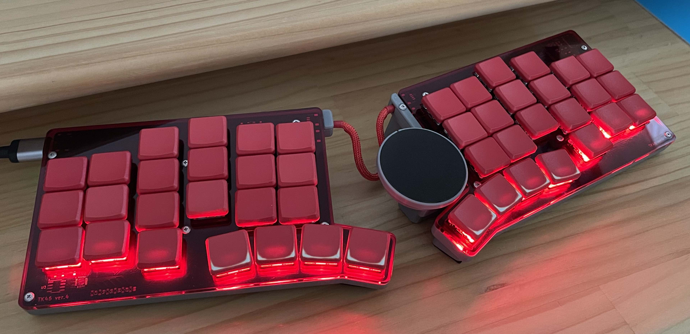

# Firmware for tk46v4 keyboard

## tk46v4

BMP firmware for tk46v4 keyboard
nRF52 BLE + IO Expander + I2C RGB LED controller with WS2812 + Cirque Trackpad



## How to make the firmware

1. build environment

```
cd /home
git clone --depth 1 -b bmp-0.11.3 https://github.com/sekigon-gonnoc/qmk_firmware.git
cd qmk_firmware
./util/qmk_install.sh
```

2. clone tk46v4 firmeare repository

```
cd /home/qmk_firmware/keyboards
git clone https://github.com/tadakado/tk46v4_firmware.git tk46v4
cd ..
```

3. extract files

```
rm quantum/pointing_device.?
tar xjvf keyboards/tk46v4/archive/bmp_add_files.tar.bz2
```

4. build firmware

```
cd keyboards/tk46v4
./build.sh 
```

5. (make archive of BMP/QMK files)

```
cd archive
./pack.sh
```
